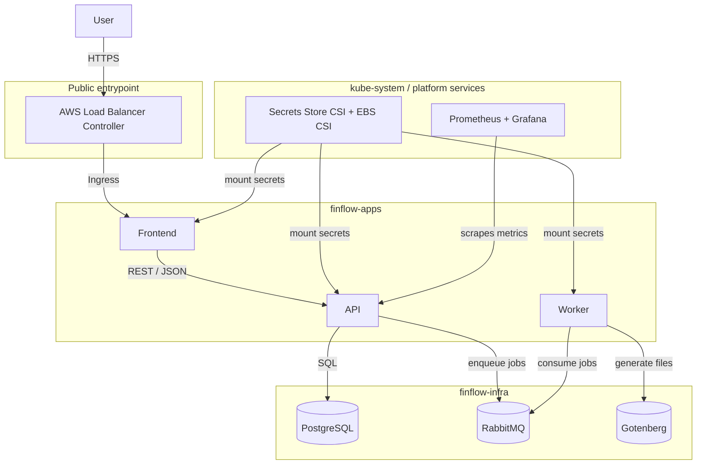

# personal-finance-analyzer-infra

Infrastructure for the FinFlow platform. Terraform provisions the AWS side, ArgoCD + Helm manage everything inside the cluster.

---

## Table of Contents

- [Repository Overview](#repository-overview)
- [How It Works](#how-it-works)
- [Project Structure](#project-structure)
- [Cluster Service Architecture](#cluster-service-architecture)
- [Prerequisites](#prerequisites)
- [Bootstrap](#bootstrap)
- [terraform.tfvars reference](#terraformtfvars-reference)
- [Cluster layout](#cluster-layout)
- [Secrets](#secrets)
- [CD pipeline](#cd-pipeline)
- [Troubleshooting](#troubleshooting)

## Repository Overview

- `terraform/`: AWS infrastructure, including VPC, EKS, IAM (IRSA), S3, Secrets Manager, and ACM.
- `k8s/`: Umbrella Helm chart managed by ArgoCD.
- `.github/workflows/`: Continuous delivery pipeline for GitOps branch updates.

The release flow is: the application repository publishes an image, triggers `repository_dispatch`, GitHub Actions updates `k8s/values.yaml` on `gitops/auto`, and ArgoCD applies the change.

## How It Works

- Terraform creates the AWS foundation, the EKS cluster, and the cluster add-ons.
- ArgoCD reconciles the Kubernetes manifests from `k8s/` and keeps the cluster in sync with Git.
- Application releases are delivered by GitHub Actions through the GitOps branch, not by manual kubectl changes.

The result is a two-layer model: Terraform manages the platform, and ArgoCD manages the workloads.

## Project Structure

```text
.
├── README.md
├── .github/
│   └── workflows/
├── k8s/
│   ├── Chart.yaml
│   ├── values.yaml
│   ├── argocd/
│   │   ├── charts/
│   │   │   ├── app-component/
│   │   │   │   ├── Chart.yaml
│   │   │   │   ├── values.yaml
│   │   │   │   └── templates/
│   │   │   │       ├── configmap.yaml
│   │   │   │       ├── deployment.yaml
│   │   │   │       ├── ingress.yaml
│   │   │   │       ├── secret.yaml
│   │   │   │       └── service.yaml
│   │   │   └── secrets-config/
│   │   │       ├── Chart.yaml
│   │   │       └── templates/
│   │   │           └── secrets-manifests.yaml
│   │   ├── config/
│   │   │   └── prometheus-stack.yaml
│   │   └── templates/
│   │       ├── applications/
│   │       │   ├── aws-load-balancer-controller.yaml
│   │       │   ├── cluster-monitoring.yaml
│   │       │   ├── dashboard-k8s-cluster.yaml
│   │       │   ├── dashboard-k8s-containers.yaml
│   │       │   ├── dashboard-node-exporter.yaml
│   │       │   ├── finflow-api.yaml
│   │       │   ├── finflow-database.yaml
│   │       │   ├── finflow-frontend.yaml
│   │       │   ├── finflow-gotenberg.yaml
│   │       │   ├── finflow-rabbitmq.yaml
│   │       │   ├── finflow-worker.yaml
│   │       │   └── secrets-sync.yaml
│   │       ├── namespaces/
│   │       │   └── finflow-monitoring.yaml
│   │       ├── projects/
│   │       │   ├── apps-project.yaml
│   │       │   ├── infra-project.yaml
│   │       │   └── monitoring-project.yaml
│   │       └── services/
│   │           └── api-alias.yaml
└── terraform/
    ├── main.tf
    ├── outputs.tf
    ├── provider.tf
    ├── terraform.tfvars
    ├── variables.tf
    └── modules/
        ├── argocd/
        ├── eks/
        ├── iam/
        ├── storage/
        └── vpc/
```

## Cluster Service Architecture



---

## Prerequisites

- Terraform ≥ 1.5
- AWS CLI configured
- kubectl, Helm ≥ 3

---

## Bootstrap

### Step 1 — Terraform

```bash
cd terraform
terraform init
terraform apply   # enable_k8s_addons=false, enable_argocd_root_app=false
```

Creates: VPC (3 AZs), EKS 1.29 (`t3.medium`, 2–4 nodes), S3 buckets, Secrets Manager secret, ACM certificate, IRSA roles.

After apply:
```bash
aws eks update-kubeconfig --region eu-central-1 --name finflow-prod-eks
```

> ACM needs DNS validation — records are in `terraform output acm_dns_validation_records`.

### Step 2 — Install ArgoCD

```hcl
# terraform.tfvars
enable_k8s_addons      = true
enable_argocd_root_app = false
```
```bash
terraform apply
```

### Step 3 — Deploy root Application

```hcl
enable_argocd_root_app = true
```
```bash
terraform apply
```

From here ArgoCD manages everything. Get the UI address:
```bash
kubectl get svc argocd-server -n argocd
# default password:
kubectl get secret argocd-initial-admin-secret -n argocd \
  -o jsonpath="{.data.password}" | base64 -d
```

---

## terraform.tfvars reference

```hcl
aws_region   = "eu-central-1"
project_name = "finflow"
environment  = "prod"

acm_domain_name               = "finflow.example.com"
acm_subject_alternative_names = ["www.finflow.example.com"]

db_password            = "..."
jwt_secret_key         = "..."
rabbitmq_username      = "finflow_user"
rabbitmq_password      = "..."
rabbitmq_erlang_cookie = "..."
slack_webhook_url      = "https://hooks.slack.com/..."

argocd_admin_password  = ""   # empty = ArgoCD generates one
gitops_repo_url        = "https://github.com/<org>/<this-repo>"
gitops_repo_revision   = "main"

enable_k8s_addons      = false
enable_argocd_root_app = false
```

---

## Cluster layout

| Namespace | What runs there |
|-----------|----------------|
| `argocd` | ArgoCD |
| `finflow-apps` | API (×2), Worker (×2), Frontend |
| `finflow-infra` | PostgreSQL 16, RabbitMQ 3.13, Gotenberg |
| `finflow-monitoring` | kube-prometheus-stack (Prometheus + Grafana) |
| `kube-system` | AWS Load Balancer Controller, EBS CSI, Secrets Store CSI |

API and Frontend get ALB Ingress. Worker is internal only (consumes RabbitMQ `jobs` exchange).

---

## Secrets

Terraform writes all secrets into a single AWS Secrets Manager entry. Inside the cluster, the Secrets Store CSI Driver mounts them as volumes and syncs to native Kubernetes Secrets. Nothing sensitive lives in this repo or in `values.yaml`.

---

## CD pipeline

Application repos trigger deployment via `repository_dispatch`:

```bash
curl -X POST \
  -H "Authorization: Bearer $GITOPS_PAT" \
  -H "Accept: application/vnd.github+json" \
  https://api.github.com/repos/<org>/<this-repo>/dispatches \
  -d '{"event_type":"app_release","client_payload":{"tag":"v1.2.3","service":"api"}}'
```

`service` accepts: `api`, `worker`, `frontend`, `all`.

The pipeline always rebuilds `gitops/auto` from `main` before patching, so the branch stays a clean single-commit snapshot.

### Required GitHub repository variables / secrets

| Name | Type | Description |
|------|------|-------------|
| `GITOPS_PAT` | Secret | PAT with `repo` scope |
| `DOCKERHUB_USERNAME` | Variable | Image registry username |
| `GITOPS_REPO_URL` | Variable | URL of this repo |
| `GITOPS_BRANCH` | Variable | e.g. `gitops/auto` |
| `S3_BUCKET_NAME` | Variable | `terraform output app_s3_bucket_name` |
| `AWS_REGION` | Variable | e.g. `eu-central-1` |
| `APP_DOMAIN` | Variable | e.g. `finflow.example.com` |
| `ACM_CERTIFICATE_ARN` | Variable | `terraform output acm_certificate_arn` |
| `AWS_APPS_ROLE_ARN` | Variable | `terraform output irsa_apps_role_arn` |
| `AWS_INFRA_ROLE_ARN` | Variable | `terraform output irsa_infra_role_arn` |

## Troubleshooting

- If ArgoCD does not sync, check the application status first: `kubectl get applications -A` and `kubectl describe application <name> -n argocd`.
- If an app is missing ingress or secrets, verify the related manifest in `k8s/argocd/templates/` and confirm the namespace exists.
- If secrets are not mounted, check the CSI driver pods in `kube-system` and the generated Kubernetes Secret in the target namespace.